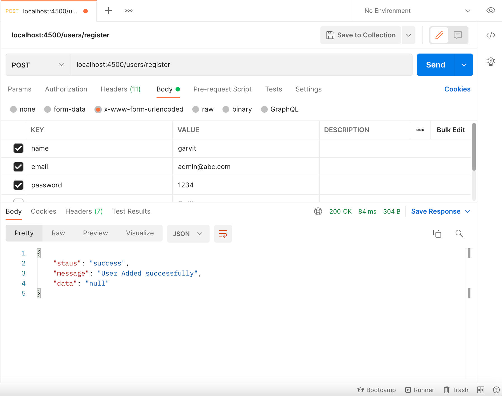

# REST-API with Authentication

In this reporistory, I have created a basic API to demonstrate code for CRUD operations. I have used jwt tokens for authentication and validation.

## Operations

1. Authentication
    - /users/register 
  (post request) create a new user
    - /users/authenticate 
  (post request) get the access token for a user
2. Create
   - /cars/  
  (post request) create a new car in the database as sent
3. Response
   - /cars/ 
  (get request) returns all the cars in the database
   - /cars/carID
  (get request)returns the details of car with the sent carID
4. Update
   - /cars/carID
  (put request)updates the details of car with the sent carID
5. Delete
   - /cars/carID
  (delete request)updates the details of car with the sent carID

## Screenshots

1. Creating a new user

2. Authenticating the user

3. Creating a car
Use the access token returned above

4. Getting the details of cars

5. Updating the car

6. Deleting the car

   